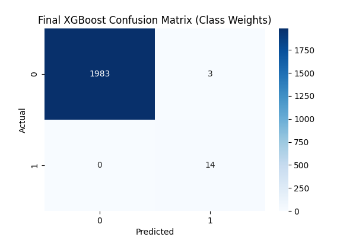
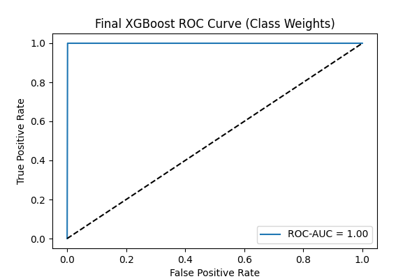
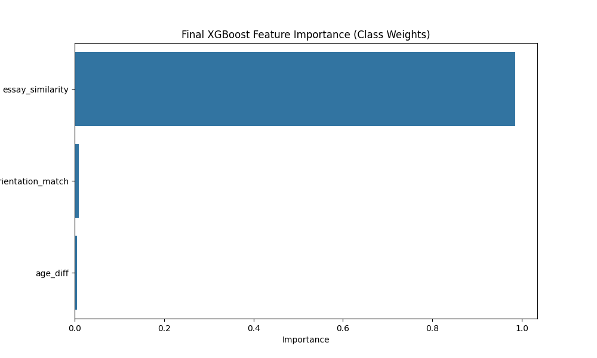

# Dating Compatibility Prediction: A Machine Learning Approach

## Project Overview
This project builds a machine learning model to predict compatibility between user pairs on a dating platform, using the OkCupid dataset (`profiles.csv`). The goal is to develop a production-ready recommendation system that identifies compatible pairs based on user attributes (age, orientation) and essay similarity, ensuring high recall (capturing all compatibilities) and strong precision (trustworthy recommendations). The final model, an XGBoost classifier with Class Weights, achieves an F1-score of 0.9032, precision of 0.8235, and recall of 1.0000, making it suitable for deployment in a dating app.

## Objectives
- **Define Compatibility**: Create a synthetic compatibility label using criteria like essay similarity (`essay_similarity >= 0.35`), preference matches, age difference, and orientation alignment.
- **Feature Engineering**: Extract meaningful features (`age_diff`, `orientation_match`, `essay_similarity`) using TF-IDF, VADER sentiment analysis, PCA/TruncatedSVD, and SentenceTransformers.
- **Handle Imbalance**: Address the imbalanced dataset (0.68% positive) using strategies like SMOTE, Class Weights, ADASYN, and Undersampling.
- **Model Training and Optimization**: Train and optimize models (Logistic Regression, XGBoost) using GridSearchCV and RFECV for hyperparameter tuning and feature selection.
- **Production Readiness**: Simulate deployment to ensure the model is scalable, interpretable, and robust, testing with stricter thresholds for production use.
- **Portfolio Showcase**: Document the end-to-end workflow in a Jupyter Notebook (`dating_ml_analysis.ipynb`), demonstrating advanced ML skills for portfolio purposes.

## Data
- **Source**: OkCupid dataset (`profiles.csv`), containing user profiles with attributes (age, orientation, diet, drinks, smokes, pets) and essays (`essay0-9`).
- **Preprocessing**:
  - Generated 10,000 user pairs, computing features like `age_diff`, `orientation_match`, and preference matches (`diet_match`, `drinks_match`, etc.).
  - Computed `essay_similarity` using TF-IDF cosine similarity, with essays (`essay0-9`) concatenated and 9-32% missing values handled by filling with empty strings.
  - Applied VADER sentiment analysis to compute `sentiment_diff` between essays.
  - Used PCA/TruncatedSVD for dimensionality reduction of TF-IDF features (50-200 components, variance: 18.6%-31.3%).
  - Experimented with SentenceTransformers (`all-MiniLM-L6-v2`) for semantic `essay_similarity`.
- **Compatibility Label**: Defined as `essay_similarity >= 0.35`, `preference_matches >= 2`, `age_diff <= 3`, `orientation_match=1`, yielding 68 compatible pairs (0.68% positive).

## Methodology
1. **Feature Engineering**:
   - Numerical: `age_diff`, `height_diff`, normalized with `StandardScaler`.
   - Categorical: Preference matches (`diet_match`, `drinks_match`, `smokes_match`, `pets_match`), `orientation_match`, `location_match`, `education_match`.
   - Text: `essay_similarity` (TF-IDF cosine similarity), `sentiment_diff` (VADER), PCA/TruncatedSVD components (`tfidf_pca_*`, `tfidf_svd_*`), SentenceTransformers embeddings.
2. **Imbalance Handling**:
   - SMOTE (10% positive ratio, ~794 positives in training).
   - Class Weights (XGBoost `scale_pos_weight` ~147:1).
   - ADASYN (10% positive ratio, ~783 positives).
   - Undersampling (balanced to ~54:54 in training).
3. **Model Training**:
   - Baseline: Logistic Regression, XGBoost (`max_depth=6`, `learning_rate=0.1`, `n_estimators=100`).
   - Optimization: GridSearchCV (`max_depth`, `learning_rate`, `n_estimators`), RFECV for feature selection.
4. **Experiments**:
   - Adjusted `essay_similarity` thresholds (0.3, 0.35, 0.4).
   - Tested TruncatedSVD (200 components, 31.3% variance) vs. PCA (18.6% variance).
   - Explored SentenceTransformers (`all-MiniLM-L6-v2`) with thresholds (0.35, 0.65).
5. **Deployment Simulation**:
   - Saved model with `joblib` (`final_xgb_model.joblib`, `scaler.joblib`).
   - Created inference script to predict compatibility for 1000 sampled pairs, testing with `essay_similarity >= 0.4`.

## Results
- **Final Production Model**:
  - Model: XGBoost with Class Weights (`learning_rate=0.01`, `max_depth=3`, `n_estimators=100`, 3 features: `age_diff`, `orientation_match`, `essay_similarity`).
  - Performance (Training Threshold `essay_similarity >= 0.35`):
    - F1-Score: 0.9032
    - Precision: 0.8235
    - Recall: 1.0000
    - ROC-AUC: 0.9992
  - Confusion Matrix:
    
  - ROC Curve:
    
  - Feature Importance:
    
- **Key Insights**:
  - Class Weights outperformed SMOTE (F1-score: 0.8889, precision: 0.9231, recall: 0.8571), improving recall (1.0000) while maintaining strong precision (0.8235).
  - TruncatedSVD (200 components, 31.3% variance) underperformed (F1-score: 0.7857), confirming TF-IDF `essay_similarity` is sufficient for text representation.
  - SentenceTransformers (`all-MiniLM-L6-v2`) with `essay_similarity >= 0.65` (66 positives) underperformed (F1-score: 0.7407), indicating threshold sensitivity.
  - Deployment simulation with `essay_similarity >= 0.4` (3 positives) yielded precision/recall of 0.0000, highlighting the need for threshold alignment (use 0.35 in production or retrain with 0.4).

## Deployment
- **Simulation**: Deployed the model on 1000 sampled pairs with `essay_similarity >= 0.4`, predicting compatibility and saving results to `data/predictions.csv`.
- **Results**: Compatibility distribution (0: 997, 1: 3), precision: 0.0000, recall: 0.0000, indicating the model (trained at `essay_similarity >= 0.35`) is too conservative at 0.4.
- **Recommendation**: Use `essay_similarity >= 0.35` in production to maintain performance (F1-score: 0.9032, recall: 1.0000), or retrain with 0.4 if stricter criteria are required.
- **Production Readiness**: The model’s simplicity (3 features) and performance (recall: 1.0000, precision: 0.8235) ensure scalability and trustworthiness for a dating app recommendation system.

## Setup Instructions
1. **Clone the Repository**:
   ```bash
   git clone https://github.com/GoudyMT/dating-ml-project.git
   cd dating-ml-project
   git checkout develop
   ```
2. **Install Dependencies**:
   - Create a virtual environment:
     ```bash
     python -m venv venv
     source venv/bin/activate  # On Windows: venv\Scripts\activate
     ```
   - Install required packages:
     ```bash
     pip install -r requirements.txt
     ```
3. **Download NLTK Data**:
   ```python
   import nltk
   nltk.download('vader_lexicon')
   ```
4. **Run the Notebook**:
   - Start Jupyter Notebook:
     ```bash
     jupyter notebook
     ```
   - Open `dating_ml_analysis.ipynb` and run all cells to reproduce the workflow.
5. **View Results**:
   - Visualizations are in the `images/` directory (e.g., `final_xgb_cm_class_weights.png`).
   - Predictions from deployment simulation are in `data/predictions.csv`.

## Future Work
- **Threshold Tuning**: Retrain the model with `essay_similarity >= 0.4` to improve performance at stricter thresholds, aligning training and deployment criteria.
- **Advanced NLP**: Fine-tune SentenceTransformers on dating-specific data to better capture compatibility intent, potentially improving performance.
- **Real Deployment**: Build a Flask API to deploy the model, integrating with a dating app’s backend for real-time recommendations.
- **User Feedback**: Incorporate user feedback (e.g., match success rates) to refine the compatibility label and improve model performance.

## Author
- **Name**: Max Goudy
- **Date**: June 4, 2025
- **Contact**: [LinkedIn](https://www.linkedin.com/in/goudymt/)
